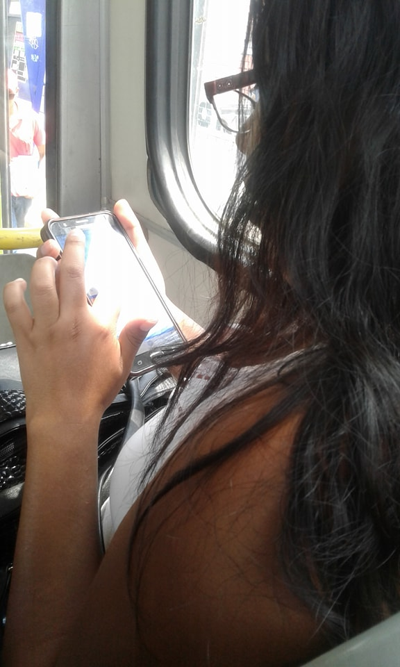

# Mi Gamarra

Mi Gamarra app proporciona la mayor información de tiendas y galerías debidamente constituidas ubicadas en el Gran Emporio Comercial de Gamarra, garantizando a los usuarios seguridad y calidad en los productos a todos los usuarios que asisten por primera vez ó frecuentemente a Gamarra.

## Desarrollado para
[Laboratoria](http://laboratoria.la)

## **RETO UX : REDISEÑO  MI GAMARRA APP**

El proyecto consiste en el rediseño de la aplicación de Mi Gamarra, para mejorar funciones de accesibilidad, funcionalidad y experiencia de usuario.Se realizó un proceso de investigación y conocimiento del usuario, permitiendonos identificar las principales necesidades y requerimientos a mejorar.

##OBJETIVO DEL PROYECTO

Brindar una aplicación que proporcione toda la información de localización y variedad de productos del Emporio Comercial Textil de Gamarra y permita que los usuarios ubiquen con facilidad y rapidez las tiendas respectivas.

## **RESEARCH**

### MI GAMARRA APP:

Gamarra es el Gran centro Comercial e Industrial del rubro textil, ubicado geográficamente en el distrito de La Victoria en Lima capital de Perú, donde encontramos casi 20,000 empresas textiles entre tiendas comerciales, fabricantes y contratistas, servicios de subcontratación y proveedores de la industria textil.

Se caracteriza por su gran extensión y la diversidad de opciones, pues es posible encontrar desde fabricantes con perfil emprendedor-microempresario hasta grandes corporaciones, dando la flexibilidad para que encuentre lo que busca ya sea usted consumidor final o empresario de negocios. Siempre encontrará una tienda o proveedor a la medida de sus requerimientos, costos competitivos y alto ratio de  calidad y precio.

Por la gran extensión territorial Mi Gamarra app proporciona la mayor información de todas las tiendas y galerías debidamente costituidas  garantizando a los usuarios seguridad y calidad en los productos a todos los usuarios que asisten por primera vez o recurrentemente a Gamarra .

### **Actividades de Investigación realizada con los usuarios**

#### Entrevistas personales.

Se realizaron entrevistas a 5 usuarios, en las que se les pidió que usaran la aplicación actual de Mi Gamarra y contaran su experiencia. A cada usuario se le pidió ingresar a cada sección de la aplicación, realizar la tarea principal y contar si logró su objetivo y como fue la experiencia.

 **Ada**

**Conclusiones de las entrevistas**

- La aplicación no permite el acceso con Facebook.
- Los contenidos de los flujos no guardan relación .
- No proporciona variedad de información respecto a las tiendas ó galerías (No refleja lo que es Gamarra).
- El diseño no es agradable.
- No se puede apreciar los mapas de localización que menciona.

#### **Encuesta virtual**

**Conclusiones de la encuesta virtual**

- La mayoría  100% de los usuarios no tenian conocimiento de la existencia de la aplicación.
- El 53% de los usuarios no ubica con facilidad las tiendas o Galerías.
- El 66.7% de los usuarios acuden esporadicamente a Gamarra.
- Cuando se les pidió que sugirieran qué funcionalidad quisieran que tenga la app, ellos consideraron importante visualizar los precios de los productos, información exacta de como acudir a sus tiendas ó galerías seleccionas y estar informados de tendencias y moda actual.

### **BENCHMARCK**

Para realizar el Benchmarcking, acudimos a las diversas aplicaciones que proporcionan el servicio de venta de prendas  online . De aplicaciones como H&M ,Saga Falabella y Oeshle.

##### **Conclusiones del Benchmarcking**

- De los otros productos encontrados enfocados en la información de prendas y demás, todos tienen la funcionalidad de presentar categorias de los productos.

- Solo dos de las aplicaciones tienen la visualización de precios.

- Solo uno puede puede brindar compra online de los productos mediante la aplicación y sección de filtros.

## **SÍNTESIS DE INFORMACIÓN**

### **User persona.**

Representa al usuario que visita de manera frecuente a Gamarra.

## **DIAGRAMA DE AFINIDAD**

Se desarrolló el análisis de las encuestas realizadas para poder recopilar toda la información sumando los resultados de las entrevistas presenciales.

Empleamos el Diagrama de Afinidad para poder identificar y clasificar los diversos problemas encontrados.

Se consideró clasificar las necesidades e inconvenientes por temas.

- Precios
- Tiendas y Galerías.
- Información.
- Mapa .
- Categorias.

### **Paper prototyping**

## Testeo

El Paper Prototyping se testeo con 7 usuarios, los cuales se pudo reconocer que el flujo se desarrollo de manera sencilla, se pudo observar la aceptación de un Mapa de localización que se detalle como acudir a la tienda o Galería seleccionada.
 Adicionalmente fue resaltante el poder visualizar los precios y se sugirió incorporar la sección de Tendencias .

## **Feedback e iteración**

### Feature List

- Registro de usuario nuevo
- Inicio de sesión con Facebook .
- Visualización de precios  y notar la disponibilidad.
- Detalle del Mapa de Localización  rapido y eficiente.
Incorporar la sección de Tendencias y moda.

### **User Flow**

El usuario puede realizar los siguientes flujos:

- Inicio de sesión y registro.
- Búsqueda de Galerías y Tiendas
- Disponer de Productos más buscados.
- Sección de Tendencias.
- Poder tener un lista de deseos  que reflejan la lista de productos preferidos con detalles de los mismos.

## **Prototipo de alta fidelidad**

[Mi Gamarra app](https://marvelapp.com/c80id09)

## **Herramientas utilizadas**

- Figma
- Marvel

Realizado por :Zulema Asto Berrocal.
