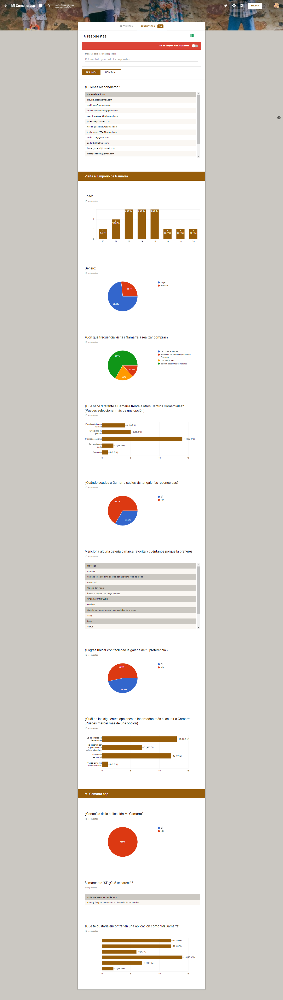
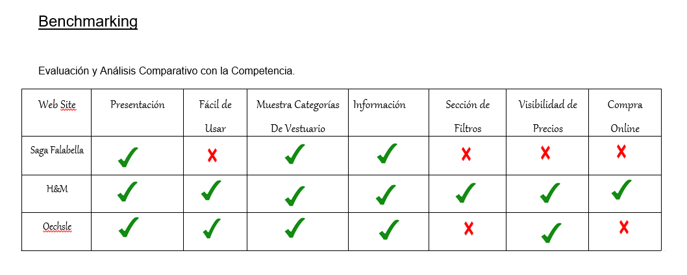
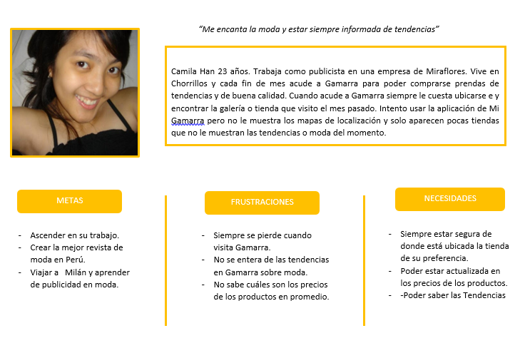
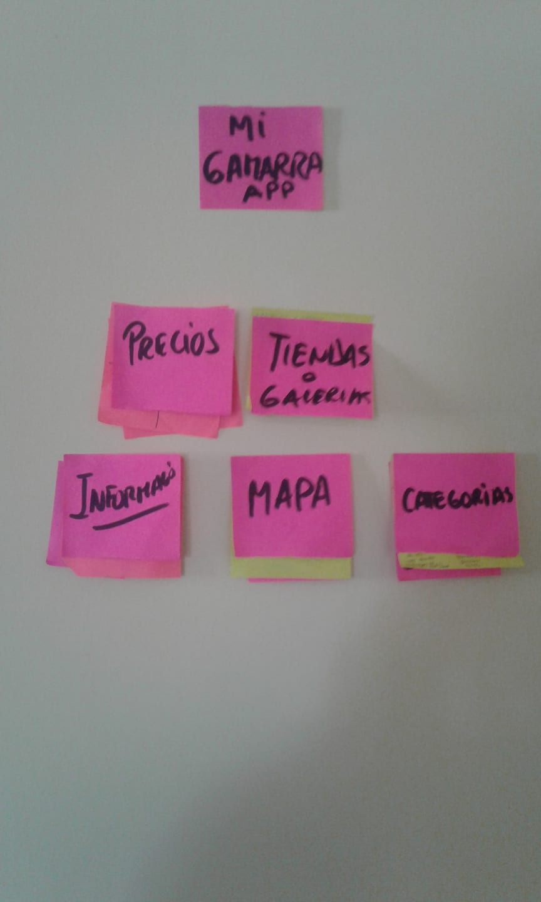
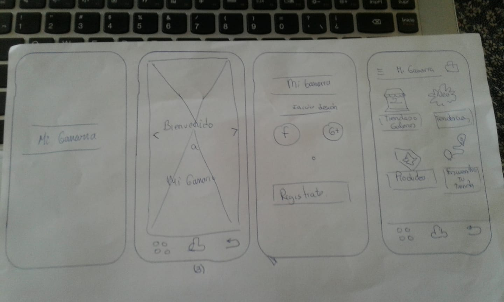
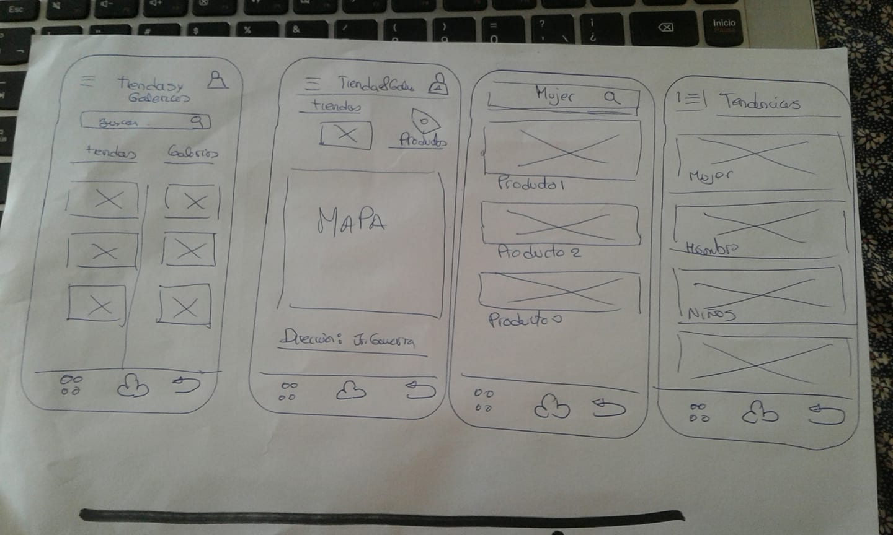

## Reto UX : Rediseño de Mi Gamarra
## Desarrollado para
[Laboratoria](http://laboratoria.la)

> Track: Common Core.  
Unidad: Proyecto UX.

# **RETO UX : REDISEÑO  MI GAMARRA APP**

El proyecto consiste en el re diseño de la aplicación de Mi Gamarra,para mejorar funciones de accesibilidad, funcionalidad yy experiencia de usuario.Se realizó un proceso de investigación y conocimiento del usuario, permitiendonos identificar las principales necesidades y requerimientos a mejorar.

##OBJETIVO DEL PROYECTO

Brindar una aplicación que proporcione toda la información de localización y variedad de productos del Emporio Comercial Textil de Gamarra y permita que los usuarios ubiquen con facilidad y rapidez las tiendas respectivas.

## **RESEARCH**

### MI GAMARRA APP:

Gamarra es el Gran centro Comercial e Industrial del rubro textil, ubicado geográficamente en el distrito de La Victoria en Lima capital de Perú, donde encontramos casi 20,000 empresas textiles entre tiendas comerciales, fabricantes y contratistas, servicios de subcontratación y proveedores de la industria textil.

Se caracteriza por su gran extensión y la diversidad de opciones, pues es posible encontrar desde fabricantes con perfil emprendedor-microempresario hasta grandes corporaciones, dando la flexibilidad para que encuentre lo que busca ya sea Ud. consumidor final, o empresario de negocios. Siempre encontrará una tienda o proveedor a la medida de sus requerimientos, costos competitivos y alto ratio calidad:precio.

Por la gran extensión territorial Mi Gamarra app proporciona la mayor información de todas las tiendas y galerías debidamente costituidas  garantizando a los usuarios seguridad y calidad en los productos a todos los usuarios que asisten por primera vez o recurrentemente a Gamarra .

### **Actividades de Investigación realizada con los usuarios**

#### Entrevistas personales.

Se realizaron entrevistas a 5 usuarios, en las que se les pidió que usaran la aplciación actual de Mi Gamarra y contaran su experiencia. A cada usuario se le pidió ingresar a cada sección de la aplicación, realizar la tarea principal y contar si logró su objetivo y como fue la experiencia.

 **Ada**

**Conclusiones de las entrevistas**

- La aplicación no permite el acceso con facebook.
- Los contenidos de los flujos no guardan relación .
- No proporciona variedad de información respecto a las tiendas o galerís (No refleja lo que es gamarra).
- El diseño no es agradable.
- No se puede apreciar los mapas de localización que menciona.

#### **Encuesta virtual**

**Conclusiones de la encuesta virtual**

- La mayoría  100% de los usuarios no tenian conocimiento de la existencia de la aplicación.
- El 53% de los usuarios no ubica con facilidad las tiendas o Galerías.
- El 66.7% de los usuarios acuden esporadicamente a Gamarra.
- Cuando se les pidió que sugirieran qué funcionalidad quisieran que tenga la app, ellos consideraron importante visualizar los precios de los productos, información exacta de como acudir a sus tiendas o galerís seleccionas y estar informados de tendencias y moda actual.

### **BENCHMARCK**

Para realizar el Benchmarck, acudimos a las diversas aplicaciones que proporcionan el servicio de venta de prendas  online . De aplicaciones como H&M ,Saga Falabella y Oeshle.

##### **Conclusiones del Benchmarcking**

- De los otros productos encontrados enfocados en la información de prendas y demás, todos tienen la funcionalidad de presenar categorias de los productos.

- Solo dos de los productos tienen la visualización de precios.

- Solo uno puede puede brindar compra online de los productos mediante la aplicación y sección de filtros.

## **SÍNTESIS DE INFORMACIÓN**

### **User persona.**

Representa al usuario que visita de manera frecuenta a Gamarra.

## **DIAGRAMA DE AFINIDAD**

Se desarrolló el análisis de las encuestas realizadas para poder recopilar toda la información sumando los resultados de las entrevistas presenciales.

Empleamos el Diagrama de Afinidad para poder identificar y clasificar los diversos problemas encontrados.

Se consideró clasificar las necesidades e inconvenientes por temas.

- Precios
- Tiendas y Galerías.
- Información.
- Mapa .
- Categorias.

### **Paper prototyping**

## Testeo

El Paper Prototyping se testeo con 7 usuarios, los cuales se pudo reconocer que el flujo se desarrollo de manera sencilla ,se pudo observar la aceptación de un Mapa de localización que se detalle como acudir a la tienda o Galería seleccionada.
 Lo resaltante fue el que se podra visualizar los preción y se sugirio incorporar la sección de Tendencias .

## **Feedback e iteración**

### Feature List

- Registro de usuario nuevo
- Inicio de sesión con Facebook .
- Visualización de precios  y notar la disponibilidad.
- Detalle del Mapa de Localización  rapido y eficiente.
Incorporar la sección de Tendencias y moda.

### **User Flow**

El usuario puede realizar los siguientes flujos:

- Inicio de sesión y registro.
- Búsqueda de Galerías y Tiendas
- Disponer de Productos más buscados.
- Sección de Tendencias.
- Poder tener un lista de deseos  que reflejan la lista de productos preferidos con detalles de los mismos.

[Detalle del user flow](https://docs.google.com/presentation/d/1A1Ju_Ly4ovMlHSL7YFyOqQF-3vnYLSmipUaP-e4Ui78/edit?usp=sharing)

## **Prototipo de alta fidelidad**

[Mi Gamarra app](https://marvelapp.com/c80id09)

## **Herramientas utilizadas**

- Figma
- Marvel

Realizado por :Zulema Asto Berrocal.

### Perfiles y hábitos de compra de los consumidores de moda online:

En la tienda online, la mayoría de compradores de moda siguen siendo mujeres (un 70%) y dentro del público femenino, las mujeres que tienen entre 16 y 29 años realizan el 54% de las compras. Por su parte, las mujeres de entre 30 y 44 años representan el 33% de las compras. En el caso de los hombres, la diferencia entre edades no es tan llamativa y las compras se dividen de la siguiente manera: el 26% entre los hombres de 16 a 29 años y el 24% entre los hombres de 30 a 44 años (según un estudio realizado por Google).

### Perfil clientes moda online :

Es interesante el dato sobre el gasto medio por compra dividido por sexos. Así, las mujeres gastan una media de 55 en cada transacción mientras que los hombres gastan 64,5 por compra. Eso sí, las mujeres realizan una media de 7,1 compras al año y mientras que los hombres solo de 5,4.

### Perfiles de compradores de moda online

Evaluando el gasto medio que realizan y a sus hábitos de compra, se pueden establecer varios tipos de perfiles de compradores de moda online (según el estudio realizado por  Google)
- El más extendido sería el perfil Trendy Low Cost (un 39% de los compradores totales). Este tipo de cliente se caracteriza por tener un elevado interés por la moda pero está muy pendiente del precio. Prefiere artículos más económicos y es muy sensible a las rebajas y descuentos.
- El segundo perfil más común es el de los fashionistas (27%), aquellos que compran sí o sí, sin mirar el precio, pero teniendo muy  en cuenta que los productos estén de moda.
- El tercer perfil son los prácticos (22%), que compran en Internet por comodidad, mientras que el último perfil se puede definir como los clásicos (11%), que compran sin mirar el precio ni las tendencias.

### Hábitos de compra de los consumidores de moda online

Sin lugar a dudas internet ha cambiado nuestros hábitos de compra y la comodidad que supone poder adquirir un producto sin necesidad de movernos de casa, por lo cual se  ha transformado los horarios de los consumidores. Así, el 70% de las compras a través de Internet se realizan entre las 4 de la tarde y las 12 de la noche. También destacar que  el 30% las compras no son planificadas. Otro dato que llama la atención es que el 70% de las compras son motivadas por la existencia de algún tipo de descuento, lo que nos indica la importancia de disponer de ofertas en nuestra tienda online.

  

## REASEARCH
Entrevistas
### **Preguntas:**

1.	¿Cuántos años tienes?

2.	¿Aquí te dedicas?

3.	¿En qué distrito vives?

4. ¿Cuales son las aplicaciones que empleas?

5.	¿Conoces el emporio Comercial de Gamarra?

6.	¿Has realizado alguna compra recientemente?

7.	¿Probaste usar la aplicación de Mi Gamarra?

8.	¿Que es lo que esperas encontrar en la aplicación?

9.	¿Te parece útil poder realizar compras mediante la aplicación?

10.	¿Porqué no realizarias compras mediante la aplicación ?
